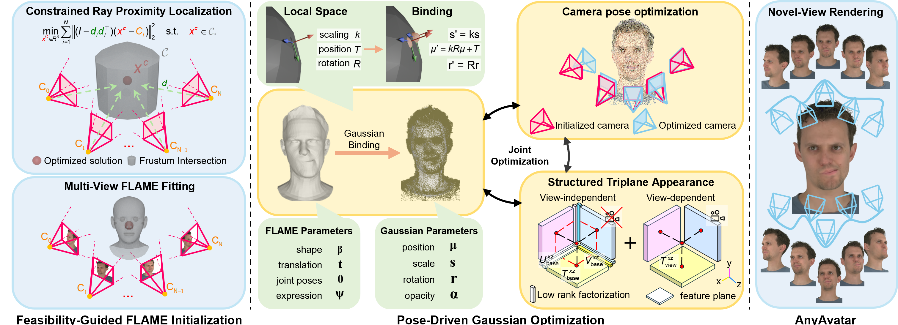

# [ACM MM 2026 Poster] AnyAvatar: High-Fidelity Gaussian Head Avatars under Uncalibrated Camera Settings

[Project](https://syncanimation.github.io/AnyAvatar.github.io/) / [Paper](https://github.com/syncanimation/AnyAvatar.github.io) 

**Yujian Liu**1,2,&#42;, **Dongxu Shen**3,&#42;, **Haoran Li**1,&#42;, **Yuting Liu**1, **Chuang Chen**1, **Xinyi Jiang**1, **Zhupeng Jiang**1, **Peng Cao**4,†, **Shidang Xu**2,†, **Xiaoli Liu**1,†

1 AiShiWeiLai AI Research  2 South China University of Technology  
3 The Hong Kong University of Science and Technology (Guangzhou)  4 Northeastern University

## Usage

### Step 1. Coarse Camera Pose Initialization

Obtain coarse camera poses with [VGGT](https://github.com/facebookresearch/vggt). Please refer to the official VGGT repository for installation and inference.

In our implementation, we use the **first frame of the neutral expression** to estimate camera poses.

### Step 2. VHAP Training

We use the camera poses estimated by VGGT to train VHAP. For specific instructions, please refer to [VHAP/README.md](VHAP/README.md).

After this step, we obtain the FLAME mesh heads that will be used for Gaussian training.

### Step 3. Gaussian Training

With the mesh heads obtained from VHAP, we can start training Gaussian head avatars. For specific instructions, please refer to [AnyAvatar/README.md](AnyAvatar/README.md).

